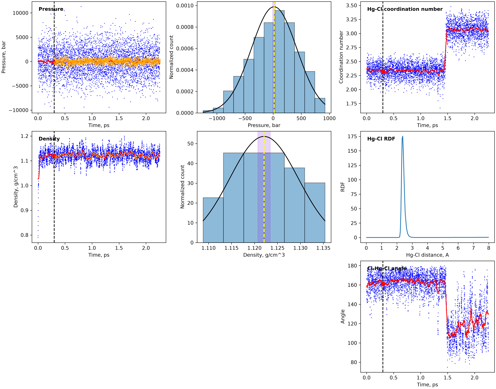
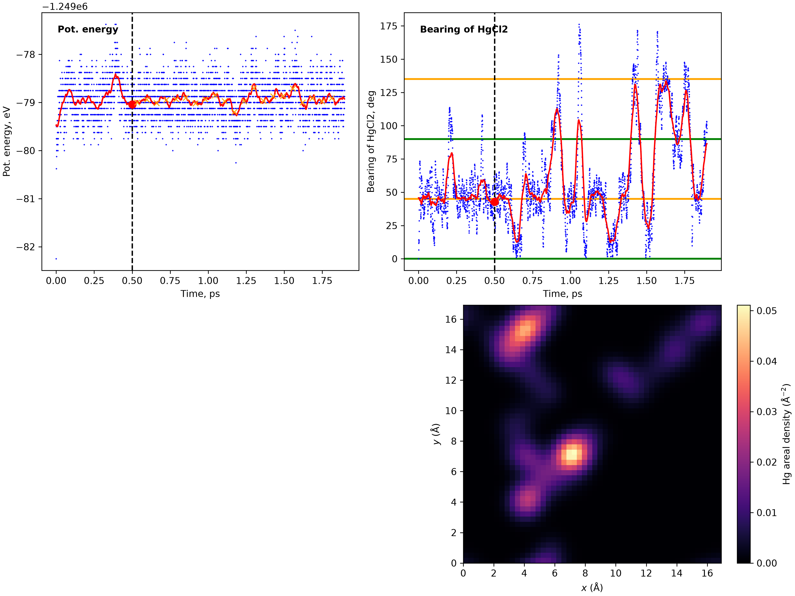

# MACE for inorganic chemistry tutorial

### Software used and their respective documentation:
- ASE [documentation](https://ase.gitlab.io/ase/) 
- MACE-Polar (pytorch / ASE implementation) [documentation](https://mace-docs.readthedocs.io/en/latest/guide/polar_mace.html) / [foundation model](https://github.com/ACEsuit/mace-foundations/releases/tag/mace_polar_1)
- Packmol [documentation](https://m3g.github.io/packmol/userguide.shtml)

### Useful commands:

`ase gui nvt.traj` - create an interactive visualization of an ASE trajectory

### Installing basic dependencies:

MACE and simulation environment:
```bash
pip install git+https://github.com/ACEsuit/mace.git@main
pip install git+https://github.com/WillBaldwin0/graph_electrostatics.git@v0.4.0
```

To accelerate on NVIDIA GPU:
```bash
pip install cuequivariance openequivariance
```

For data post-processing:
```bash
pip install pandas uncertainties pyblock
```

### Calculator setup:

The calculator is initialized in a separate file in the root of the repository: `mace_calculator.py`.
This way it can be reused by all simulations.

## Part 1: minimization of a molecule

In working directory `01_molecule_minimization`, run:
```shell
python 01a_minimize_water_with_mace.py
```
A water molecule is created and minimized with MACE-polar potential. The minimized configuration is written
to `water_minimization_mace/water_minimized.xyz`. Minimizer statistics are written to
`water_minimization_mace/optimization.log`. The progress of minimization can be visualized with:
```shell
ase gui water_minimization_mace/optimization.traj
```
LBFGS minimizer was used in this example. It is known to converge quickly when the initial guess is good.
Other minimizers, like FIRE for poor initial guesses, are available in ASE.

## Part 2: bulk solution MD

In working directory `02_bulk_solution_md`, run:
```shell
python 02a_minimize_HgCl2.py
```
Similarly to the previous example with water, an HgCl2 molecule is created and minimized. The minimized structure is
written to `HgCl2_minimization/HgCl2_minimized.xyz`

Now, with packmol in your path, run:
```shell
cd 02b_pack_molecules
python generate_input.py
packmol < in.pack
cd ..
```
This generates a packmol input file and calls packmol. Packmol inserts sodium / chloride ions in four corners of the
box, one HgCl2 molecule - in the center of the box, and randomly packs water molecules in between.

Now, a MD simulation can be run with:
```shell
python 02c_run_md.py
```
The simulation consists of two stages: relaxation in NVT to relax possible bad initial geometry and
equilibration in NPT to bring the periodic system to a hydrostatic pressure of 1 bar.

The analysis can be performed with:
```shell
python 02d_plot_results.py
```
Pressure and density are plotted as a metric to detect equilibration. Hg / Cl coordination number is
plotted to detect the reaction of HgCl2 with Cl- and Na+ to form HgCl3- and Na+. Cl RDF around the
Hg atom is plotted to determine the Hg-Cl bond length. Cl-Hg-Cl angle is plotted as an additional
metric that helps detect a reaction event. A linear HgCl2 molecule becomes trigonal planar when reacted
to form HgCl3-.



## Part 3: adsorption MD

In working directory `03_adsorption_md`, run:
```shell
python 03a_run_md.py
```
The simulation places an HgCl2 molecule above a (001) NaCl slab and samples interaction of the molecule
with the surface in NVT ensemble.

The analysis can be performed with:
```shell
python 03b_plot_results.py
```
Potential energy and bearing of the linear HgCl2 molecule relative to the y-axis are plotted. The molecule
hops between sites with strong bonding, where the molecule is oriented diagonally (bearing of 45 or 135 degrees).
A spatial density map of Hg in the XY plane is also plotted. Additional analysis can focus on the distance
of Hg from strongly-bonded surface sites determined from the density map.


